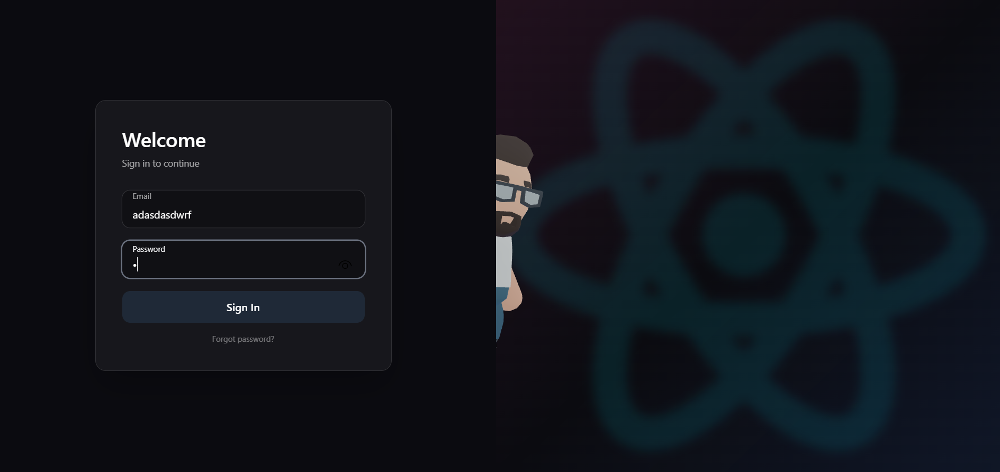

# Cinematic 3D Login Experience

> A next-generation authentication interface where UI meets real-time 3D interaction.

A visually immersive login experience built with **React, Three.js, and modern UI principles**.
This project redefines authentication by turning it into a **cinematic, responsive interaction system**.

---

##  Preview

<p align="center">
  
</p>

---

##  Concept

Traditional login forms are static.
This project introduces a **behavior-driven interface** where:

* The system reacts to user input
* A 3D character progressively enters the scene
* Motion, depth, and feedback create a **living UI**

---

##  Core Mechanics

###  Input → Animation Pipeline

User input is converted into a dynamic **progress system**:

```js
if (len === 0) setProgress(0)
else if (len < 3) setProgress(0.2)
else if (len < 6) setProgress(0.5)
else setProgress(1)
```

This value directly controls the 3D scene.

---

###  Multi-Phase Character Behavior

The character animation is divided into stages:

| Phase   | Description                   |
| ------- | ----------------------------- |
|  Look | Character observes the screen |
|  Head | Subtle movement begins        |
|  Body | Character enters the scene    |
|  Full | Full presence & motion        |

Smooth transitions are achieved using:

* Custom `damp()` interpolation
* Non-linear easing functions
* Time-based oscillations

---

###  Cinematic Reveal System

* Blur layer hides the 3D scene initially
* As user types → blur fades out
* Character emerges behind the UI

```js
${progress > 0.3 ? 'opacity-0' : 'opacity-100'}
```

This creates a **depth illusion** and cinematic transition.

---

##  UI / UX Design

### Glassmorphism Panel

* Transparent blurred container
* Soft borders & shadows
* Floating label inputs

### Micro Interactions

* Button scaling
* Smooth focus transitions
* Subtle hover feedback

### Authentication Flow

* Error handling
* Loading states
* Password reset modal

---

##  Tech Stack

* **Next.js (App Router)**
* **React**
* **@react-three/fiber**
* **@react-three/drei**
* **Three.js (GLTF + Animation system)**
* **Tailwind CSS**


---

##  Project Structure

```
/components
  ├── Character.jsx     # 3D animation logic
  ├── Scene.jsx         # Canvas + lighting
  ├── LoginUI.jsx       # UI layer
  └── canvas/
       └── View.jsx     # Render abstraction

/app
  └── page.jsx          # Main orchestration (UI + 3D sync)

/public
  ├── models/
  │    └── character.glb
  └── img/
```

---

##  Getting Started

```bash
git clone https://github.com/your-username/your-repo.git

cd your-repo
npm install
npm run dev
```

Open:

```
http://localhost:3000
```

---

##  Demo Credentials

```txt
Email: admin@demo.com
Password: 123456
```

---

##  Interaction Logic

| Input State  | Behavior           |
| ------------ | ------------------ |
| Empty        | Character hidden   |
| Typing       | Character reacts   |
| Medium input | Movement increases |
| Full input   | Full reveal        |


---

##  Philosophy

> Interfaces should not just respond — they should *react*.

This project explores the idea of turning UI into a **living system**
where user actions directly shape the experience.

---

##  License

MIT License

---

##  Author

**Cihan Sarı**

* GitHub: https://github.com/ChnSari
* LinkedIn: https://linkedin.com/in/cihansri
* Email: [cihannsri@gmail.com](mailto:cihannsri@gmail.com)

